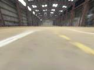
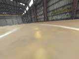
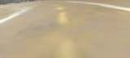

# Machine Learning Engineer Nanodegree
## Capstone Project
Luciano Silveira  
January, 2020

## I. Proposal

Refer to the proposal [here](../proposal/proposal.md).

### Domain Background

Machine Learning is starting to touch all aspects of our life, in particular it has a lot of potential for automation in robotic applications.

Being part of the [donkeycar2 robocar community](http://www.donkeycar.com/), an opensource do it yourself self-driving platform for small scale cars; there are many possibilities for exploration in that space.

In this context, the exploration and experimentation has been done mainly with `supervised learning` and the community is starting to play around with `reinforcement learning` (RL) algorithms.

The project objective is to implement a classification model for the robocar to detect where it is in a specific race track so the model can be used for other high level models. In particular, it would be useful for `reinforcement learning` and to explore how to autonomously navigate a track withing the specified lane. That is, to implement a classification system for a robotic application, building an inference engine extracting information from a race track.

### Problem Statement

In the last few year the development of robotics applications using Machine Learning framework has exploded. This project explores the usage of different Machine Learning models to be used as a inference engine for classification; a classifier to detect a robot within a track and the possible actions to do: go `Straight`, turn `Left` or `Right`. That is to say identify 3 possible classes:

 * Straight or Center of the track
 * Left side of the track
 * Right side of the track

## II. Analysis

### Datasets and Inputs

For this phase a robocar was run to follow a standard race track in recording mode. After a few laps, it recorded hundreds of 160x120 RGB images. The sample track is as follows:


The training and test data was manually classified and organized in the following classes: `Straight`, `Left`, `Right`; the folder structure:

```
data/
├── Left/
│   ├── 47_cam-image_array_.jpg
│   ├── ...
│   └── 48_cam-image_array_.jpg
├── Right/
│   ├── 46_cam-image_array_.jpg
│   ├── ...
│   └── 47_cam-image_array_.jpg
└── Straight/
    ├── 25_cam-image_array_.jpg
    ├── ...
    └── 26_cam-image_array_.jpg
```

The images distribution by class is:

 * Left: 702 images
 * Right: 719 images
 * Straight: 841 images

Some examples:

__**Right**__


__** Left **__


__** Straight **__


Classes by definition are not balanced, in general when normally driving there will be more samples from `Straight` than the `Left`, `Right` cases; special emphasis must be done to get more data from the missing classes. In particular, our track is almost an oval so it is important to note that we needed to run the robocar in two ways to get equal number of `right` and `left` turns.

Some examples of the type of images from the simulator (Left, Straight, Right):





All data is within the [data](./data/) folder.

## III. Methodology

The project was divided in the following steps:

* Data gathering and manual classification
* Framework exploration
* Training and validation
* Summarization of the results

### Data Preprocessing

Manually classify the images in 3 classes: `Straight`, `Left`, `Right` and divide the resultset into two groups: training and valudation.

Augument data to get more information for the training process to avoiding overfitting. Some ideas to explore are:

 * grayscale: convert the image to grayscale.
 * Augmentation: Generate random changes on images, such as modification of contranst and coloring to have an effect in the lighting conditions.
   * Horizontal flip of the image
 * Cropping: remove not useful parts of the image to concentrate on an specific region of interest (ROI).
 * Normalization: rescale the image data from values between 0 and 255 to values between 0 and 1, as neural networks prefer to deal with small input values.

Detail on this exploration can be chacked on the [DataManagement](./DataManagement.ipynb) jupyter notebook.
 
Some links on these steps:

* [How to prepare/augment images for neural network?](https://datascience.stackexchange.com/questions/5224/how-to-prepare-augment-images-for-neural-network)
* [Introduction to Dataset Augmentation and Expansion](https://algorithmia.com/blog/introduction-to-dataset-augmentation-and-expansion)
* [AutoML for Data Augmentation](https://blog.insightdatascience.com/automl-for-data-augmentation-e87cf692c366)

### Data Exploration

The following analysis was done on the images.

In general, for the problem we are trying to solve only the bottom part of the image is relevant for classification, so we select a region of interest


and cropped the image to get only the neccesary bits.


An alternative analyisis is to change the image to grayscale to remove the 3 RGB channels and only keep one channel:


Plus some analysis on edge detection using [Canny Edge detection](https://en.wikipedia.org/wiki/Canny_edge_detector)


and thesholding it to find the continuous relevant edges. Finally the selection is to keep the 3 RGB channels but just center on the selected region of interest.

This section was valiadted with the [Data Management](DataManagement.ipynb) jupyter notebook.

#### Input Image Structure

The image provided by the simulator and in runtime is a RGB encoded height:120px and width:160.

As the camera is in a fixed position and the higher part of it is useless for the classification task, it is cropped the upper part of it and just feed the network with a smaller Image containing only lane information. For example (Straight cropped image):



### Framework Exploration

Based on the [Build an Image Dataset in TensorFlow](https://github.com/aymericdamien/TensorFlow-Examples/blob/master/examples/5_DataManagement/build_an_image_dataset.py) article, differnt code sections were developed to evaluate different training alternatives.

A detail analysis can be checked on the [Classification And Evaluation](ClassificationAndEvaluation.ipynb) jupyter notebook.

### Refinement

The following classifiers were created:

 * Version 1
 * Version 2
 * Version 3

#### Version #1

Initial version for a classifier; the objective was to create a working pipeline:

 * read the correct images
 * separete them for train and validation
 * train a classifier
 * evaluate results

The model consists of a couple of Convolutions and Fully connected layer to output 3 classes using the *ADAM* optimizer and *categorical cross entropy* loss function, taking into account *accuracy* as metric for evaluation.

```
Layer (type)                 Output Shape              Param #   
=================================================================
conv2d_1 (Conv2D)            (None, 120, 160, 16)      448       
_________________________________________________________________
max_pooling2d_1 (MaxPooling2 (None, 60, 80, 16)        0         
_________________________________________________________________
dropout_1 (Dropout)          (None, 60, 80, 16)        0         
_________________________________________________________________
conv2d_2 (Conv2D)            (None, 60, 80, 32)        4640      
_________________________________________________________________
max_pooling2d_2 (MaxPooling2 (None, 30, 40, 32)        0         
_________________________________________________________________
conv2d_3 (Conv2D)            (None, 30, 40, 64)        18496     
_________________________________________________________________
max_pooling2d_3 (MaxPooling2 (None, 15, 20, 64)        0         
_________________________________________________________________
dropout_2 (Dropout)          (None, 15, 20, 64)        0         
_________________________________________________________________
flatten_1 (Flatten)          (None, 19200)             0         
_________________________________________________________________
dense_1 (Dense)              (None, 512)               9830912   
_________________________________________________________________
dense_2 (Dense)              (None, 3)                 1539      
=================================================================
Total params: 9,856,035
Trainable params: 9,856,035
Non-trainable params: 0
```

The result of the training for 15 epochs is detailed as follows:


And validation of information was created to check the associated result


The image details that out of 4 random samples; 2 were correctly classified.

#### Version #2

For the following iteration, the objective was to use a similar CNN from the [robocars project](https://github.com/autorope/donkeycar/blob/dev/donkeycar/parts/keras.py), change the output to be a classifier.

This CNN is deeper than the previous version; it uses 5 layers of Convolutions interleaving with Dropout and finally a series of Fully connected layer plus randomly dropout 10% of the neurons to prevent overfitting. Finally, assign classification percentages for 3 classes.

```
Layer (type)                 Output Shape              Param #   
=================================================================
img_in (InputLayer)          (None, 120, 160, 3)       0         
_________________________________________________________________
conv2d_4 (Conv2D)            (None, 58, 78, 24)        1824      
_________________________________________________________________
dropout_3 (Dropout)          (None, 58, 78, 24)        0         
_________________________________________________________________
conv2d_5 (Conv2D)            (None, 27, 37, 32)        19232     
_________________________________________________________________
dropout_4 (Dropout)          (None, 27, 37, 32)        0         
_________________________________________________________________
conv2d_6 (Conv2D)            (None, 12, 17, 64)        51264     
_________________________________________________________________
conv2d_7 (Conv2D)            (None, 5, 8, 64)          36928     
_________________________________________________________________
dropout_5 (Dropout)          (None, 5, 8, 64)          0         
_________________________________________________________________
conv2d_8 (Conv2D)            (None, 3, 6, 64)          36928     
_________________________________________________________________
dropout_6 (Dropout)          (None, 3, 6, 64)          0         
_________________________________________________________________
flattened (Flatten)          (None, 1152)              0         
_________________________________________________________________
dense_3 (Dense)              (None, 100)               115300    
_________________________________________________________________
dropout_7 (Dropout)          (None, 100)               0         
_________________________________________________________________
dense_4 (Dense)              (None, 50)                5050      
_________________________________________________________________
dropout_8 (Dropout)          (None, 50)                0         
_________________________________________________________________
class_out (Dense)            (None, 3)                 153       
=================================================================
Total params: 266,679
Trainable params: 266,679
Non-trainable params: 0
```

The CNN was modified as follows:

```python
#Class output
class_out = Dense(class_count, activation='softmax', name='class_out')(x)

model = Model(inputs=[img_in], outputs=[class_out])
model.compile(optimizer='adam',
			  loss={'class_out': 'categorical_crossentropy'},
			  loss_weights={'class_out': 0.1},
			  metrics=['accuracy'])
return model
```

The result of the training is detailed as follows:


And better validation of results:


#### Version #3

For the next iteration real experimentation took place. The following changes where applied to prevent overfitting the CNN:

 * Reduce the capacity of the network
 * Add weight regularization
 * Add Batch Normalization
 * Modify the dropout

Ideas taken from [Overfit and Underfit](https://github.com/tensorflow/docs/blob/master/site/en/r1/tutorials/keras/overfit_and_underfit.ipynb)

##### Dropout

A technique to reduce overfitting is to apply dropout to the CNN. It is a form of regularization that forces the weights in the network to take only small values, which makes the distribution of weight values more regular and the network can reduce overfitting on small training examples. Dropout is one of the regularization technique applied. The following values were tested, 0.3 was selected.

```python
drop = 0.3 #0.1 # 0.2 # 0.4
```

When appling 0.1 dropout to a certain layer, it randomly kills 10% of the output units in each training epoch. This means dropping out 10%, 20% or 40% of the output units randomly from the applied layer, at the ends makes a more robust network. The case was applied to different convolutions and fully-connected layers.

References on this section:

* [Build an Image Dataset in TensorFlow](https://github.com/aymericdamien/TensorFlow-Examples/blob/master/examples/5_DataManagement/build_an_image_dataset.py)
* [Image classification](https://www.tensorflow.org/tutorials/images/classification)

##### Region Of Interest and Salience

Based on the data exploration done in [DataManagement](./DataManagement.ipynb); it was trimmed the higher part of the image:

```python
x = Cropping2D(cropping=((40,0), (0,0)))(x)
```

The decision to use this feature is related to the *Salience* analysis for the track. The goal of this kind of visualization is to understand what learns and how a CNN makes its decisions. The central idea in discerning the salient objects is finding parts of the image that correspond to locations where the feature maps of CNN layers have the greatest activations. Based on the [keras-salient-object-visualisation](https://github.com/ermolenkodev/keras-salient-object-visualisation) project; we tested a couple of images using a saliency heatmap.

__** Salience Heatmap for the whole image **__


__** Salience Heatmap ROI image **__


Notice that the second section has a much stronger focus on the lane lines and everything else is discarded as is not needed as input for the classification task.

References on this section:

* [Make Movie from Tub](https://docs.donkeycar.com/utility/donkey/) with optional --salient will overlay a visualization of which pixels excited the NN the most.
* [Original paper](https://arxiv.org/pdf/1704.07911.pdf)

##### Batch Normalization

Applied the ideas from [Normalization](https://keras.io/layers/normalization/); apply a transformation that maintains the mean activation close to 0 and the activation standard deviation close to 1.

```python
x = BatchNormalization(input_shape=default_shape)(x)
```

##### Keras Improvements

Besides, several improvements related to the Keras framework were added:

 * Save a model checkpoint
 * Early stopping when the training is not improving after 7 epochs.

```python
#checkpoint to save model after each epoch
save_best = keras.callbacks.ModelCheckpoint(saved_model_path,
                                            monitor=monitor,
                                            verbose=verbose,
                                            save_best_only=True,
                                            mode='min')

#stop training if the validation error stops improving.
early_stop = keras.callbacks.EarlyStopping(monitor=monitor,
                                           min_delta=min_delta,
                                           patience=patience,
                                           verbose=verbose,
                                           mode='auto')
```

The result of the training is detailed as follows:


And better validation of results were obtained:


## IV. Results

### Model Evaluation and Validation

For the pipeline evaluation, we created a video with a couple of laps around the selected track and executed it. Some samples:


The complete video:

[video_result01](./data/tub_1_18-05-25_output.mp4)

### Justification

## V. Conclusion

### Reflection

The use of Salience Analysis was important to improve the classifier.

### Improvement

 * Get more training data and classify it
 * data-augmentation; use horizontal flip to auto-generate more Left and Right samples.
 * Select and existing models for image classification with weights already trained: (for example [ImageNet Model Zoo for TensorFlow](https://github.com/joeddav/tensorflow-modelzoo) or [Keras applications](https://keras.io/applications/)) and retrain the classifier for our purposes.
-----------

### Links

 * [Donkeycar Github repository](https://github.com/autorope/donkeycar)
 * [Train autopilot docs](http://docs.donkeycar.com/guide/train_autopilot/)
 * [Reinforcement Learning](https://pathmind.com/wiki/deep-reinforcement-learning)
 * [watermark](https://www.watermarquee.com/watermark)
 * [Save and Restore Models](https://github.com/tensorflow/docs/blob/master/site/en/r1/tutorials/keras/save_and_restore_models.ipynb)
 * [Techniques to Tackle Overfitting and Achieve Robustness for Donkey Car Neural Network Self-Driving Agent](https://flyyufelix.github.io/2019/06/04/pixmoving-hackathon.html)
 * [Keras](https://keras.io/)
 * [Training sandbox](https://github.com/autorope/notebooks/blob/master/notebooks/train%20on%20all%20data.ipynb)
