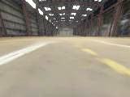
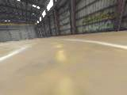
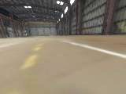
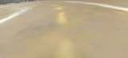
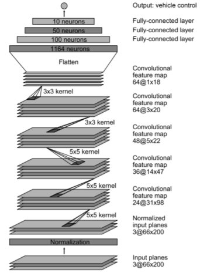

# Machine Learning Engineer Nanodegree
## Capstone Proposal
Luciano Silveira  
December, 2019

## Proposal

### Domain Background

Machine Learning is starting to touch all aspects of our life, in particular it has a lot of potential for automation in robotic applications.

Being part of the [donkeycar2 robocar community](http://www.donkeycar.com/), an opensource do it yourself self-driving platform for small scale cars; there are many possibilities for exploration in that space.

In this context, the exploration and experimentation has been done mainly with `supervised learning` and the community is starting to play around with `reinforcement learning` (RL) algorithms.

My objective is to implement a classification model for the robocar to detect where it is in a specific race track so the model can be used for other high level models. In particular, it would be useful for `reinforcement learning` and to explore how to autonomously navigate a track withing the specified lane.

The robocar (an agent within the RL enviornment) makes the decision of what action to take depending on the feedback provided by the classification model, trying to always be on the `Center` of the track.

### Problem Statement

The objective is to train an inference system to explore possible usage on small scale robots within a known environment. The model will need to predict the location of the car within a known track, that is to say identify 3 possible classes:

 * Center of the track
 * Left side of the track
 * Right side of the track
 
### Datasets and Inputs

The dataset can be gathered from the [simulator](http://docs.donkeycar.com/guide/simulator/) or using [sample driving data](https://drive.google.com/open?id=1A5sTSddFsf494UDtnvYQBaEPYX87_LMp) from the community.

Once the data adquisition is defined; the training and test data must be manually classified and organized in the following classes: `Center`, `Left`, `Right`. The classification process will be done manually an all classes will be assigned to different folders; a tentative folder structure is as follows:

```sh
data
├───testing
│   ├───Center
│   ├───Left
│   └───Right
└───training
    ├───Center
    ├───Left
    └───Right
```

Classes by definition are not balanced, in general when normally driving there will be more samples from `Center` that the `Left`, `Right`; special emphasis must be done to get more data from the missing classes.

Some examples of the type of images from the simulator (Left, Center, Right):





Some Image Processing may be needed, such as use grayscale, normalization, contrast analysis, image cropping etc...

### Solution Statement

The objective is to correctly classify the images received from the donkeycar with accuracy and high confidence, so it can be used as reliable information from other algorithms.

Part of the problem is to evaluate different algorithms and models to do the task. The robocar community mainly uses the [Keras framework](https://keras.io/) to [train the autopilot](http://docs.donkeycar.com/guide/train_autopilot/) but our exploration is not restricted to it and could explore and evaluate other frameworks and algorithms.

In particular, the [keras.py](https://github.com/autorope/donkeycar/blob/dev/donkeycar/parts/keras.py) details different supervised learning models with different input and outputs.

### Benchmark Model

To get started, use an off-the-shelf classification model such as the [LeNet model](http://yann.lecun.com/exdb/lenet/) which is implemented in different frameworks and adapt it for our classification task. It can be seen as a vanilla CNN model for Digits classification.

Use more specific models, such as the [End to End Learning for Self-Driving Cars](http://images.nvidia.com/content/tegra/automotive/images/2016/solutions/pdf/end-to-end-dl-using-px.pdf) by [NVidia](https://developer.nvidia.com/deep-learning), which details a specific layer of convolutions to output the directions to drive a car; adapt the final layers to make it a classifier and compare against the first model.

### Evaluation Metrics

The metrics to be used are those related when using a CNN Convolution Neural Network to classify images; in general a variation of `Softmax` is used to select a class; depending on the framework used, the [activation functions](https://keras.io/activations/) will be analyzed and tested.

Evaluate the different available [loss functions](https://keras.io/losses/) to compare Training vs Test data.

Build a 3x3 Multi-Class Confusion Matrix to quantify the performance of the classification algorithm, calculate other metrics such a Precision, Recall to get the F1 Score.

### Project Design

The project is expected to be divided in the following steps:

* Data gathering and manual classification
* Framework exploration
* Training and validation
* Summarization of the results

#### Data Management

Use the provided [simulator](http://docs.donkeycar.com/guide/simulator/) to collect data or directly download existing images from the community.

Manually classify the images in 3 classes: `Center`, `Left`, `Right` and divide the resultset into two groups: training (70%) and testing (30%).

Augument data to get more information for the training process to avoiding overfitting. Some ideas to explore are:

 * Horizontal flip of the image
 * Generate random changes on images, such as modification of contranst and coloring to have an effect in the lighting conditions.
 * Cropping
 * normalize the image

Some links on these steps:

* [How to prepare/augment images for neural network?](https://datascience.stackexchange.com/questions/5224/how-to-prepare-augment-images-for-neural-network)
* [Introduction to Dataset Augmentation and Expansion](https://algorithmia.com/blog/introduction-to-dataset-augmentation-and-expansion)
* [AutoML for Data Augmentation](https://blog.insightdatascience.com/automl-for-data-augmentation-e87cf692c366)

##### Input Image Structure

The image provided by the simulator is a RGB encoded height:120px and width:160.

As the camera is in a fixed position and the higher part of it is useless for the classification task, it is expected to crop the upper part of it and just feed the network with a smaller Image containing only lane information. For example (Center cropped image):



Only Image data will be feed to the CNN, some research is needed to check if RGB or just grayscale data is enough (3 vs 1 input dimension).

##### Data Collection

Based on the [donkeycar autopilot documentation](http://docs.donkeycar.com/guide/train_autopilot/) site, it is needed to collect 5-20k images for the training process, which seems to be aroung 10 laps around the selected track. Classes balancing will be checked manually so as to get the same ammout of images for the 3 classes.

#### Framework Exploration

Initially, evaluate the existing code from the [Keras framework](https://keras.io/) and train classifiers changing different part of the pipeline. Change the layers of the CNN, reduce or expand the architecture complexity, check if there are some generalizable architecture to be reused for this task.

The most used model is structured as follows and are several variations:

```python
def default_categorical(input_shape=(120, 160, 3), roi_crop=(0, 0)):

    opt = keras.optimizers.Adam()
    drop = 0.2

    #we now expect that cropping done elsewhere. we will adjust our expeected image size here:
    input_shape = adjust_input_shape(input_shape, roi_crop)

    # First layer, input layer, Shape comes from camera.py resolution, RGB
    img_in = Input(shape=input_shape, name='img_in') 
    x = img_in
    # 24 features, 5 pixel x 5 pixel kernel (convolution, feauture) window, 2wx2h stride, relu activation
    x = Convolution2D(24, (5,5), strides=(2,2), activation='relu', name="conv2d_1")(x)
    # Randomly drop out (turn off) 10% of the neurons (Prevent overfitting)
    x = Dropout(drop)(x)
    # 32 features, 5px5p kernel window, 2wx2h stride, relu activatiion
    x = Convolution2D(32, (5,5), strides=(2,2), activation='relu', name="conv2d_2")(x)
    # Randomly drop out (turn off) 10% of the neurons (Prevent overfitting)
    x = Dropout(drop)(x)
    if input_shape[0] > 32 :
        x = Convolution2D(64, (5,5), strides=(2,2), activation='relu', name="conv2d_3")(x)
    else:
        x = Convolution2D(64, (3,3), strides=(1,1), activation='relu', name="conv2d_3")(x)
    if input_shape[0] > 64 :
        x = Convolution2D(64, (3,3), strides=(2,2), activation='relu', name="conv2d_4")(x)
    elif input_shape[0] > 32 :
        x = Convolution2D(64, (3,3), strides=(1,1), activation='relu', name="conv2d_4")(x)
    # Randomly drop out (turn off) 10% of the neurons (Prevent overfitting)
    x = Dropout(drop)(x)
    # 64 features, 3px3p kernal window, 1wx1h stride, relu
    x = Convolution2D(64, (3,3), strides=(1,1), activation='relu', name="conv2d_5")(x)
    # Randomly drop out (turn off) 10% of the neurons (Prevent overfitting)
    x = Dropout(drop)(x)
    # Possibly add MaxPooling (will make it less sensitive to position in image).  Camera angle fixed, so may not to be needed

    # Flatten to 1D (Fully connected)
    x = Flatten(name='flattened')(x)
    # Classify the data into 100 features, make all negatives 0
    x = Dense(100, activation='relu', name="fc_1")(x)
    # Randomly drop out (turn off) 10% of the neurons (Prevent overfitting)
    x = Dropout(drop)(x)
    # Classify the data into 50 features, make all negatives 0
    x = Dense(50, activation='relu', name="fc_2")(x)
    # Randomly drop out 10% of the neurons (Prevent overfitting)
    x = Dropout(drop)(x)
    
    #categorical output of the angle
    # Connect every input with every output and output 15 hidden units. Use Softmax to give percentage. 15 categories and find best one based off percentage 0.0-1.0
    angle_out = Dense(15, activation='softmax', name='angle_out')(x)

    #continous output of throttle
    # Reduce to 1 number, Positive number only
    throttle_out = Dense(20, activation='softmax', name='throttle_out')(x)

    model = Model(inputs=[img_in], outputs=[angle_out, throttle_out])
    return model
```

NVidia provided an initial starting point with the CNN architecture from the [End to End Learning for Self-Driving Cars](http://images.nvidia.com/content/tegra/automotive/images/2016/solutions/pdf/end-to-end-dl-using-px.pdf) paper.



Iterate until the evaluation metrics are satisfied otherwise evaluate other frameworks and start again.

#### Conclusion

Summarization of the results.

-----------

### Links

 * [Donkeycar Github repository](https://github.com/autorope/donkeycar)
 * [Train autopilot docs](http://docs.donkeycar.com/guide/train_autopilot/)
 * [Reinforcement Learning](https://pathmind.com/wiki/deep-reinforcement-learning)
